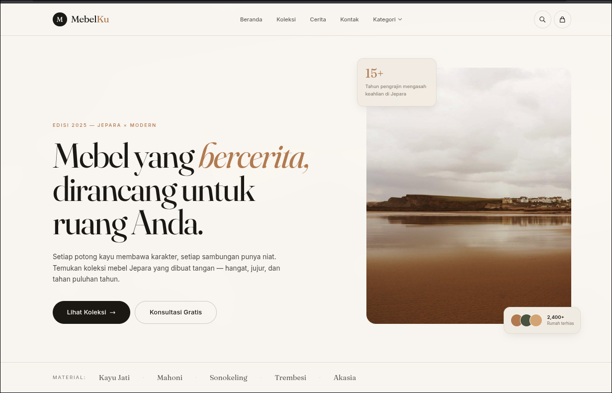

# MabelKu

> Mebel kayu premium dari Jepara. Single-store e-commerce dengan admin dashboard, keranjang, checkout, dan integrasi WhatsApp.



Dibangun dengan **Astro fullstack** — ringan, SEO-friendly, dan siap deploy ke VPS dengan Node adapter.

---

## Stack

| Layer | Tech |
|---|---|
| Framework | [Astro 5](https://astro.build) (SSR + hybrid) |
| Styling | [Tailwind CSS 4](https://tailwindcss.com) + Fraunces / Inter |
| Database | SQLite (via `better-sqlite3`) |
| ORM | [Drizzle ORM](https://orm.drizzle.team) |
| State | [nanostores](https://github.com/nanostores/nanostores) + persistent (cart) |
| Auth | bcryptjs + session cookie |
| Runtime | [Bun](https://bun.sh) |

---

## Fitur

### Pelanggan
- Homepage dengan hero, kategori, produk unggulan, koleksi terbaru
- Katalog dengan filter kategori, pencarian, sort
- Halaman kategori (cover hero + grid)
- Detail produk dengan galeri, spesifikasi, related products
- Keranjang belanja (persistent di localStorage)
- Checkout dengan multi-payment method (transfer / COD / WhatsApp)
- Halaman sukses + redirect WhatsApp otomatis
- Halaman Tentang & Kontak
- Floating WhatsApp button

### Admin
- Login admin (session cookie)
- Dashboard ringkasan (produk, pesanan, pendapatan, stok menipis)
- Manajemen produk (CRUD)
- Manajemen kategori
- Manajemen pesanan + ubah status
- Pengaturan toko (nama, logo, WhatsApp, alamat, hero, social)

---

## Struktur

```
src/
├── components/
│   ├── common/      # Navbar, Footer, WhatsAppButton
│   ├── product/     # ProductCard, CategoryCard
│   ├── cart/        # store.ts (nanostores)
│   └── admin/       # Sidebar, Topbar
├── layouts/
│   ├── MainLayout.astro
│   └── AdminLayout.astro
├── pages/
│   ├── index.astro
│   ├── produk/
│   ├── kategori/
│   ├── keranjang.astro
│   ├── checkout.astro
│   ├── checkout/sukses/[orderCode].astro
│   ├── tentang.astro
│   ├── kontak.astro
│   ├── admin/
│   └── api/
├── lib/
│   ├── db/          # Drizzle schema + push
│   ├── auth.ts
│   ├── images.ts
│   ├── money.ts
│   ├── product.ts
│   ├── store.ts
│   └── whatsapp.ts
├── styles/
│   └── global.css   # design system
└── middleware.ts
```

---

## Memulai

### Prasyarat
- [Bun](https://bun.sh) ≥ 1.0
- Node 20+ (opsional, Bun sudah include)

### Install

```bash
bun install
```

### Setup database

```bash
bun run db:push      # apply schema
bun run db:seed      # seed sample data (opsional)
```

### Development

```bash
bun run dev
```

Buka `http://localhost:4321`

### Build & production

```bash
bun run build
bun run start        # PORT=4321 node ./dist/server/entry.mjs
```

### Admin

Login di `/admin/login`. Default credential bisa diatur via seed atau langsung di database.

---

## Skrip

| Command | Fungsi |
|---|---|
| `bun run dev` | Dev server |
| `bun run build` | Build production |
| `bun run start` | Run production build |
| `bun run db:push` | Apply schema ke DB |
| `bun run db:seed` | Isi data contoh |
| `bun run db:studio` | Drizzle Studio (GUI DB) |

---

## Environment

Tidak butuh `.env` untuk pengembangan. Untuk production, set variabel berikut di environment server:

```bash
PORT=4321
NODE_ENV=production
DATABASE_URL=./data/mabelku.db   # opsional, default ke path ini
```

---

## Deployment

Output adapter: `@astrojs/node` (standalone mode).

```bash
bun run build
NODE_ENV=production node ./dist/server/entry.mjs
```

Reverse proxy (Nginx/Caddy) → point ke port 4321. Database SQLite di-mount sebagai persistent volume di `/data`.

---

## Lisensi

Private — © 2025 MabelKu.
